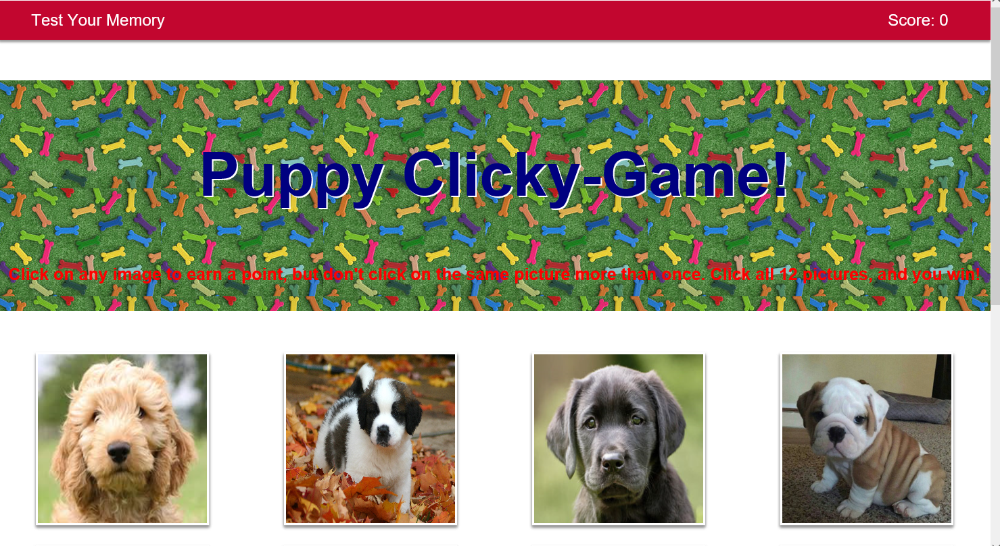

# React-Clicky-Game

## Overview

This is a memory game using React. The application's UI is split into four components.

## How it Works:

*The application renders 12 different images to the screen, and keeps track of the user's score. 
*The user's score is incremented when clicking an image for the first time. 
*The user's score will reset to 0 if they click the same image more than once. 
*Every time an image is clicked, the images rendered to the page will shuffle themselves in a random order.
*Once the user's score is reset after an incorrect guess, the game will restart.

## Technologies used

* React
* ES6
* Bootstrap
* CSS

## Website
https://afternoon-atoll-46846.herokuapp.com/
